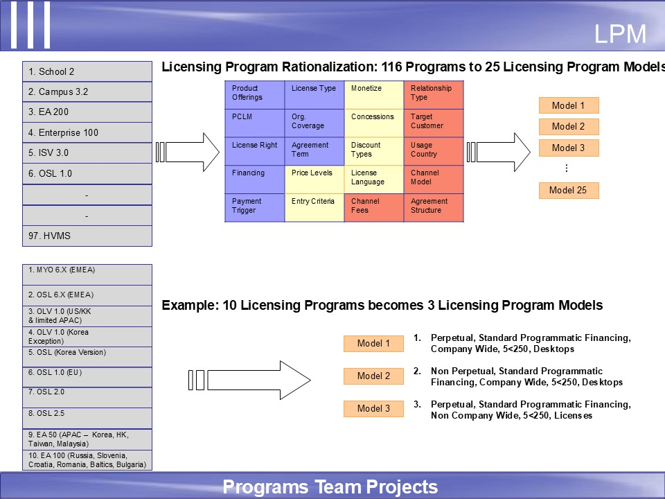
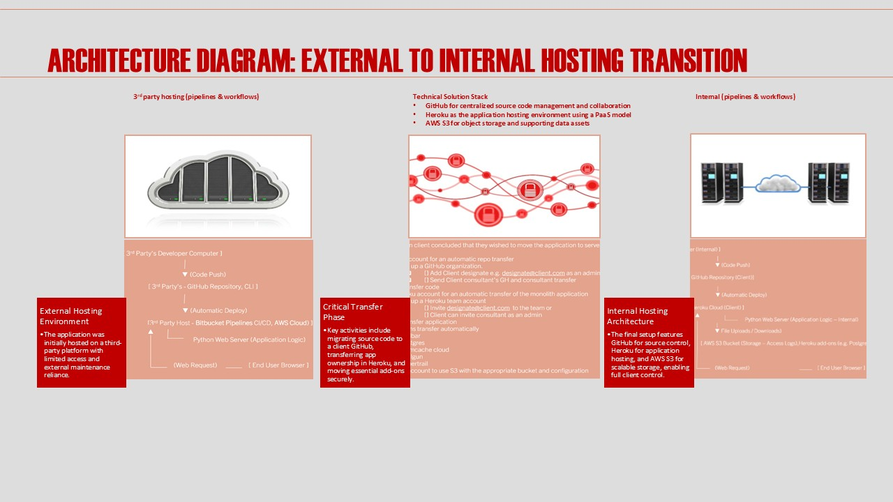

<!--Section 1:  Introduce yourself-->
##  ABOUT ME

Hello!  I’m Don Mitchell, a metrics driven, strategist, technical program manager and product owner with a passion for developing and managing programs to successful closure, and executing the product lifecycle to deliver data focused digital product solutions from concept to launch.  Recognized for successfully facilitating cross-functional group dynamics, maintaining understanding/impact of emerging technologies, regulations, and needs, with a deep network of contacts in public sector and technology ecosystems.

<!--Mention your top/relevant skills here – core and soft skills-->
##  SKILLS
 
*I use data and technology to help organizations shape strategy, improve performance, and drive adoption across the public and education sectors. My background spans technology-adjacent roles with leading organizations in both the technology and public sectors. Currently, I work as an education management consultant at Edusightsolutions LLC, supporting public sector institutions with technology integration, assessment administration, application development and the strategic rollout of performance and data systems.*
 
**-    
AWS Cloud Solution Architecture Consulting.  **
Guiding customers on best practices, cloud strategy, and service selection, often focusing on ROI and Business Development rather than implementation.
 
**-     
Technical Program Management.  **
Managing full project management lifecycle executing disciplines of SCRUM, PMP with facilitation of communication between technical and non-technical teams, managing complex group dynamics, managing timelines, caretaking stakeholders and overseeing project resources.
 
**-     
Technical Product Management.  **
Provide full product management lifecycle including areas like NLP, AI, and Cloud executing from concept to launch with facilitation of communication between technical and non-technical teams, managing complex group dynamics, managing timelines, caretaking stakeholders.

<!--Section 2:  List 3-4 key projects-->
## MY PROJECTS
 
*A glimpse of some of the projects I’ve worked on.* 
 
**How I helped Microsoft Enterprise Global SW Licensing increase customer satisfaction by reducing # of Worldwide Licensing Models by 76%, thus reducing complexity, using a configuration modeling approach**

Licensing Program Models are Microsoft’s product-like constructs used to monetize intellectual property (e.g. servers, desktop suite, OS, etc.)

<a href="Licensing Program Models GitHub Project Description.pdf">Download the full project description here (pdf file)</a>

**Transferring and hosting client's Social Emotional Learning (SEL) APP from 3rd party to internal hosting on own servers**

Three critical areas:  Source Code & Platform Transition (client-controlled GitHub environment); Infrastructure Setup & Hosting Enablement (cloud-based hosting architecture using Heroku, PAAS); Operational Readiness & Deployment Strategy (process details for deployment, scaling, maintenance, etc.)

<a href="SEL_Architecture_Diagram_Enhanced 1 Final.pdf">Download the full project description here (pdf file)</a>

## CONTACT

📧 mitchelldonaldleon@gmail.com
🔗 https://www.linkedin.com/in/donmitchell1
